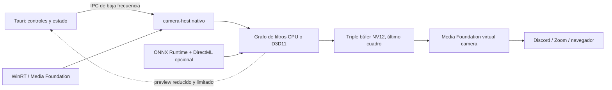

# Arquitectura de referencia para CameraTuner

Fecha del análisis: 2026-08-13
Alcance: captura, filtros, transporte entre procesos, cámara virtual, recuperación ante fallos, uso de CPU/GPU y reescalado por IA.

## Conclusión ejecutiva

Tauri no es un impedimento para lograr baja latencia. Debe seguir siendo el plano de control y la interfaz; ningún cuadro de resolución completa debería atravesar JavaScript ni el WebView. El camino caliente debe permanecer en procesos y componentes nativos.

El siguiente cambio prioritario no es ocultar un cuadro corrupto repitiendo el anterior. Es reemplazar el transporte actual de un solo slot por tres slots de último-cuadro, mantener el archivo mapeado durante toda la sesión y publicar NV12 ya procesado. Esta combinación reduce carreras entre productor y consumidor, elimina aperturas y mapeos por cuadro y evita que la cámara virtual repita una conversión BGRA→NV12 en cada solicitud.

La ruta objetivo es:

La evolución recomendada es incremental y medible:

1. instrumentar cada etapa;
2. estabilizar el transporte CPU con triple búfer y mapeo persistente;
3. integrar libyuv y reutilizar memoria;
4. mover el grafo de filtros a D3D11, conservando una ruta CPU;
5. incorporar reescalado IA como componente opcional con ONNX Runtime y DirectML.

### Estado de aplicación al 2026-08-13

La Fase 0 y el núcleo de la Fase 1 ya están implementados: `CTFRAME2` usa tres slots, token de publicación atómico, generación y heartbeat; los lectores Rust poseen una prueba concurrente; la Media Source v7 conserva el mapping abierto y regula `RequestSample` según el FPS negociado. `camera-host` emite métricas agregadas cada diez segundos. La prueba Media Foundation extremo a extremo entregó 178 cuadros en unos 6,1 segundos, sin muestras azules o negras. Continúa pendiente publicar NV12 directamente e integrar libyuv.

## Método y reproducibilidad

Los repositorios se clonaron superficialmente en `research/reference-implementations/`. La revisión exacta, el origen y la licencia están fijados en `reference-lock.json`. `fetch-references.ps1` reproduce o verifica esos clones sin modificar silenciosamente uno que esté en otra revisión.

Los clones están ignorados por Git: no se distribuyen como parte de CameraTuner. El análisis separa patrones arquitectónicos de código que legalmente podría integrarse. OBS, pyvirtualcam, Webcamoid y AkVirtualCamera son referencias GPL; si CameraTuner termina bajo MIT, no se debe copiar su implementación.

## Qué hace CameraTuner hoy

La captura WinRT solicita ARGB32 en `crates/windows-camera/src/media_capture.rs`. Para cada cuadro adquiere el último `MediaFrameReference`, copia el `SoftwareBitmap` a un `Buffer` y después lo transforma en un `Vec`. El canal de notificación está acotado y `TryAcquireLatestFrame` ya aplica una política correcta para tiempo real: si hay atraso, importa el cuadro más reciente, no una cola histórica.

Después, `camera-host` procesa los filtros en CPU, puede redimensionar y publica BGRA en el transporte compartido. El escritor mantiene su mapeo abierto, pero el protocolo posee un solo slot protegido con secuencia par/impar.

La fuente Media Foundation instalada se genera a partir de `native/windows-camera.patch`. En cada `RequestSample` actualmente:

- abre el archivo de cuadros;
- crea un file mapping;
- llama a `MapViewOfFile`;
- copia o escala BGRA;
- convierte RGB32/BGRA a NV12 cuando el consumidor lo pide;
- desmonta el mapeo.

Esta ruta funciona, pero combina tres riesgos: el consumidor puede coincidir con una sobrescritura del único slot, se recrean recursos del sistema por muestra y el mismo cuadro recorre memoria varias veces.

El preview no usa el tamaño completo: se limita aproximadamente a 960 píxeles de ancho, convierte a RGB, redimensiona y genera JPEG. Aun así, su frecuencia debería limitarse a 10–15 FPS y su trabajo debe descartarse si ya hay una codificación anterior pendiente.

## Coste de memoria del formato actual

Las cifras siguientes son por cada copia o pasada completa, no el coste total del pipeline:

| Resolución y frecuencia | BGRA por cuadro | BGRA por segundo | NV12 por cuadro | NV12 por segundo |
|---|---:|---:|---:|---:|
| 1280×720 a 30 FPS | 3,52 MiB | 105,5 MiB/s | 1,32 MiB | 39,6 MiB/s |
| 1920×1080 a 30 FPS | 7,91 MiB | 237,3 MiB/s | 2,97 MiB | 89,0 MiB/s |
| 1920×1080 a 60 FPS | 7,91 MiB | 474,6 MiB/s | 2,97 MiB | 178,0 MiB/s |
| 3840×2160 a 30 FPS | 31,64 MiB | 949,2 MiB/s | 11,87 MiB | 356,0 MiB/s |

Por eso una cadena de varios filtros de color, resize, publicación, lectura y conversión puede gastar varios GiB/s de ancho de banda interno sin que ningún algoritmo individual parezca caro. Reducir pasadas y asignaciones suele dar más resultado que agregar más hilos.

## Hallazgos por proyecto

### OBS Studio

Archivos principales:

- `obs-studio/plugins/win-dshow/shared-memory-queue.c`
- `obs-studio/plugins/win-dshow/virtualcam-module/virtualcam-filter.cpp`

Su transporte mantiene el mapping abierto y reserva tres cuadros NV12. El productor llena un slot que no está publicado y solo después actualiza el índice visible; el consumidor toma el índice más reciente. La cámara virtual usa timestamps propios y puede repetir el contenido necesario para mantener el reloj de salida.

Aplicar:

- triple búfer de último-cuadro;
- mapping persistente;
- salida NV12 como formato rápido;
- reloj de salida independiente de la irregularidad de captura.

No aplicar literalmente:

- su escalador NV12 nearest-neighbor, que el propio código marca como provisional;
- código GPL dentro de una distribución MIT.

### Microsoft Windows Camera

Archivos principales:

- `windows-camera/Samples/VirtualCamera/MediaSource/SimpleMediaStream.cpp`
- `windows-camera/Samples/VirtualCamera/MediaSource/AugmentedMediaStream.cpp`

Es la referencia primaria para el ciclo de vida de una fuente Media Foundation moderna. Reutiliza un `IMFVideoSampleAllocator`, asigna tiempo y duración a cada muestra y despacha `MEMediaSample`. El ejemplo inicializa un conjunto de muestras y maneja explícitamente start, stop y flush.

Aplicar:

- allocator y pool persistentes;
- transiciones de estado explícitas;
- timestamps y duraciones monotónicos;
- negociación conservadora de tipos de medio.

No tomar su generador de cuadros como referencia de rendimiento: es código didáctico y usa pasos intermedios evitables.

### pyvirtualcam

Archivos principales:

- `pyvirtualcam/src/virtual_output.h`
- `pyvirtualcam/src/virtual_output_obs.cpp`
- `pyvirtualcam/src/virtual_output_unity_capture.cpp`

En Windows confirma dos decisiones: reutiliza el transporte triple-buffer de OBS y utiliza libyuv para conversiones. Su backend Unity consulta si existe un receptor antes de realizar trabajo costoso. También usa un reloj de alta resolución para regular la entrega.

Aplicar:

- detectar consumidores y reducir trabajo cuando nadie utiliza la cámara virtual;
- libyuv como fallback CPU;
- regulación de frecuencia con reloj monotónico.

### Spout2

Archivos principales:

- `spout2/SPOUTSDK/SpoutDirectX/SpoutDirectX.cpp`
- `spout2/SPOUTSDK/SpoutDirectX/SpoutDX.cpp`

Spout2 demuestra un transporte D3D11 entre procesos mediante texturas compartidas, handles NT y keyed mutex. También contempla selección de adaptador, timeouts y recuperación de un mutex abandonado. Sus comentarios recuerdan que una copia GPU es asíncrona y que forzar una espera tiene coste.

Aplicar en la fase GPU:

- registrar y validar el LUID del adaptador;
- recursos `D3D11_USAGE_DEFAULT` sin acceso CPU;
- sincronización acotada, nunca espera infinita;
- recuperación de device-lost y recreación completa del grafo;
- no hacer readback salvo que un plugin CPU o el preview lo exija.

Spout2 no es por sí solo una cámara virtual ni reemplaza Media Foundation.

### Webcamoid

Archivos principales:

- `webcamoid/libAvKys/Plugins/VideoFilter`
- `webcamoid/libAvKys/Lib/src/akglcompositor.cpp`

Su catálogo confirma que conviene modelar brillo, contraste, gamma, flip, crop, LUT/corrección y efectos como nodos independientes ordenados. El compositor OpenGL reutiliza FBO y texturas, ejecuta en un hilo de render y evita `glReadPixels` si nadie solicita salida CPU.

Aplicar como diseño:

- contrato uniforme de filtros;
- grafo ordenado y serializable;
- recursos persistentes por resolución;
- readback bajo demanda;
- separar plugins CPU y GPU mediante capacidades declaradas.

No copiar su implementación GPL3. Para Windows, D3D11 encaja mejor con WinRT y Media Foundation que introducir OpenGL como segundo ecosistema gráfico.

### AkVirtualCamera

Archivos principales:

- `akvirtualcamera/src/VCamUtils/src/ipcbridge.cpp`
- `akvirtualcamera/src/VCamUtils/src/frameserver.cpp`
- `akvirtualcamera/src/VCamUtils/src/mediasource.cpp`

Usa una fuente Media Foundation, un servicio IPC y señalización de listeners. Es valioso para estudiar demanda de consumidores, tokens de muestra, negociación y corrección de deriva temporal. Su servicio, locks y copias agregan complejidad que CameraTuner todavía no necesita.

Aplicar conceptos de heartbeat y listener; evitar incorporar ahora un servicio permanente adicional.

### UnityCapture derivado

El repositorio original que se había mencionado ya no está disponible públicamente. Se fijó `Virtual-Camera-For-Windows`, un derivado MIT que conserva el enfoque de UnityCapture.

Usa un gran búfer compartido, mutex y eventos de “quiero cuadro/cuadro enviado”. La señal de demanda es útil, pero un único búfer y una espera de mutex larga pueden bloquear al productor. Para CameraTuner es inferior a un triple búfer de publicación atómica.

### libyuv

Archivos principales:

- `libyuv/include/libyuv/convert_argb.h`
- `libyuv/include/libyuv/scale.h`
- `libyuv/source/row_any.cc`

Ofrece BGRA/ARGB↔NV12, escalado, rotación y matrices de color con despacho SIMD para SSE, SSSE3, AVX, AVX2, AVX-512 y otras arquitecturas. Es una dependencia pequeña y compatible con MIT/BSD.

Aplicar primero para:

- BGRA→NV12 de salida;
- conversiones de formatos negociados;
- resize CPU de compatibilidad;
- rotación y flip cuando la ruta GPU no esté disponible.

Los filtros simples consecutivos deben fusionarse en una sola pasada propia o en una LUT/matriz compilada; llamar a una función por filtro conserva demasiadas pasadas de memoria.

### DirectML y ONNX Runtime

Archivos principales:

- `directml/Samples/DirectML_ESRGAN`
- `onnxruntime/include/onnxruntime/core/providers/dml/dml_provider_factory.h`

La muestra oficial ESRGAN confirma que DirectML cubre superresolución. Crea el dispositivo y las colas una vez; los operadores compilados, tablas de bindings y recursos persistentes se reutilizan. ONNX Runtime simplifica carga de modelos y selección del Execution Provider DirectML, a cambio de binarios y memoria adicionales.

Decisión recomendada:

- primera versión: ONNX Runtime + DirectML como paquete opcional;
- sesión y modelo creados una vez por preset;
- buffers y bindings reutilizados;
- FP16 cuando el adaptador lo soporte;
- máximo un cuadro de IA en vuelo y política latest-only;
- tiles con solapamiento para limitar VRAM;
- fallback a Lanczos cuando se incumpla el presupuesto temporal;
- DirectML nativo solo si mediciones posteriores justifican el coste de ingeniería y la reducción de footprint.

Lanczos sigue siendo “reescalado de alta calidad”, no IA. La UI solo debe rotular IA cuando haya un modelo cargado realmente.

### FFmpeg

`ffmpeg/libavutil/hwcontext_d3d11va.c` muestra correctamente pools D3D11, superficies `AV_PIX_FMT_D3D11`, staging solo para transferencias y `CopySubresourceRegion` con Map/Unmap al cruzar CPU/GPU.

No se recomienda FFmpeg en el núcleo de la cámara para captura UVC, filtros simples o publicación Media Foundation: duplicaría abstracciones, aumentaría tamaño y complicaría licencias/distribución. Sí puede ser un módulo opcional futuro para archivos, red o un formato comprimido que las APIs de Windows no decodifiquen correctamente. Su build predeterminado es LGPL; habilitar componentes GPL cambia las obligaciones.

## Diagnóstico del parpadeo azul

No existe todavía evidencia suficiente para adjudicar cada parpadeo a una única línea. El cuadro azul repetido evita que el usuario vea basura, pero es una política de resiliencia, no la corrección raíz.

Hay dos debilidades demostradas que pueden producir o amplificar el síntoma:

1. un único slot compartido permite que el productor comience a sobrescribir mientras el consumidor intenta obtener una instantánea;
2. abrir, mapear y cerrar el transporte dentro de cada `RequestSample` introduce churn y más puntos de fallo o retraso.

El protocolo par/impar detecta muchas colisiones, pero no evita todo el trabajo desperdiciado ni garantiza que siempre haya un slot estable disponible. El triple búfer sí permite conservar al menos un cuadro publicado mientras se escribe el siguiente. Después de implementarlo, los contadores permitirán distinguir entre cuadro rechazado, captura ausente, deadline perdido, reinicio de dispositivo y fallo de consumidor.

Política correcta ante una interrupción corta:

- mantener el último cuadro válido durante una ventana breve;
- entregar muestras con timestamps nuevos y monotónicos;
- contar y registrar duplicados de forma agregada;
- después del timeout, emitir un cuadro negro o de privacidad explícito;
- nunca publicar memoria parcialmente escrita.

## Protocolo de transporte propuesto: CTFRAME2

Cabecera global versionada:

- magic y versión;
- generación de sesión para detectar reinicios;
- tres descriptores de slot;
- índice publicado y secuencia global;
- heartbeat del productor;
- número de consumidores o heartbeat de demanda;
- capacidad máxima y flags.

Cada slot:

- secuencia propia;
- estado libre/escribiendo/publicado;
- ancho, alto, formato y stride;
- timestamp monotónico de captura;
- longitud válida;
- flags de discontinuidad, duplicado o placeholder;
- payload NV12 alineado.

Publicación:

1. elegir un slot distinto del publicado;
2. marcarlo escribiendo;
3. llenar metadata y payload;
4. publicar su secuencia con semántica release;
5. cambiar el índice global con semántica release.

Lectura:

1. cargar índice y secuencia con semántica acquire;
2. copiar o envolver el slot;
3. verificar que índice y secuencia no cambiaron;
4. si cambiaron, reintentar una vez con el slot publicado más reciente;
5. si no existe uno nuevo, reutilizar el último válido sin bloquear.

El mapping, los handles, el allocator de Media Foundation y los buffers de conversión se crean al iniciar la sesión o cambiar de formato; no por cuadro.

## Grafo de filtros objetivo

El orden visible de filtros debe coincidir con el orden de ejecución. Internamente cada nodo declara:

- formatos de entrada y salida;
- backend CPU, GPU o ambos;
- si es puntual, espacial o temporal;
- parámetros y rangos seguros;
- si puede fusionarse;
- coste estimado y memoria temporal;
- comportamiento ante cambio de resolución.

Optimización:

- brillo, contraste, gamma, saturación y temperatura consecutivos se compilan en una sola pasada/shader;
- LUT y matriz de color comparten shader cuando sea viable;
- lens correction, crop, flip y resize se combinan en una única transformación espacial cuando no cambia el resultado esperado;
- dos texturas o buffers ping-pong cubren nodos no fusionables;
- las asignaciones se rehacen solo al cambiar formato, resolución o grafo;
- un plugin CPU dentro de un grafo GPU declara explícitamente el coste de readback/upload.

Los plugins de terceros no deberían cargar DLL nativas arbitrarias dentro del proceso principal en la primera versión estable. Conviene comenzar con un manifiesto y shaders validados o ejecutar plugins nativos en un host aislado para que un fallo no derribe la captura.

## Plan de implementación y criterios de aceptación

### Fase 0 — telemetría local de rendimiento

Medir, sin registrar una línea por cuadro:

- captura/espera;
- copia desde WinRT;
- filtros por categoría;
- resize;
- conversión a NV12;
- publicación y lectura;
- tiempo de `RequestSample`;
- secuencias perdidas, muestras duplicadas y placeholders;
- reinicios de dispositivo y device-lost GPU.

Emitir agregados cada 5–10 segundos y conservar un ring buffer de eventos anómalos. Criterio: poder explicar un parpadeo mediante contadores y timestamp sin llenar el disco.

### Fase 1 — transporte estable CPU

- implementar CTFRAME2 triple-slot;
- mantener mapping abierto en productor y Media Source;
- publicar NV12 final;
- usar fast path cuando formato y resolución coincidan;
- conservar el borrado de `frame-v1.bin` en el desinstalador durante la migración;
- tests de publicación concurrente y reinicio de generación.

Criterios:

- cero lecturas parciales en pruebas de estrés;
- cámara virtual 1080p30 durante 30 minutos sin cuadro corrupto;
- secuencias salientes y timestamps monotónicos;
- ninguna apertura/mapeo por muestra en steady state;
- memoria estable tras cambios repetidos de filtro.

### Fase 2 — CPU eficiente

- integrar libyuv con notices;
- pools y buffers reutilizables;
- fusionar filtros puntuales;
- limitar preview a 10–15 FPS y descartar trabajos viejos;
- no procesar salida completa si no hay preview ni consumidor virtual.

Criterio inicial en 1080p30, sin IA: uso sostenido medido y sin crecimiento; presupuesto por cuadro inferior a 33,3 ms con margen suficiente para el juego. No se fija un porcentaje universal de CPU porque depende del hardware: se registrará p50, p95 y p99 en la máquina de prueba.

### Fase 3 — D3D11 end-to-end

- obtener `Direct3DSurface` desde WinRT cuando el formato lo permita;
- shaders HLSL fusionados y texturas ping-pong;
- transporte de textura compartida inspirado en Spout2;
- integrar `IMFDXGIDeviceManager`/buffers DXGI cuando Frame Server lo acepte;
- ruta NV12 CPU siempre disponible como fallback;
- recuperación completa ante cambio de adaptador o device-lost.

Criterios: ninguna readback en el camino normal GPU; no esperar indefinidamente un keyed mutex; mismo resultado visual dentro de tolerancia respecto del backend CPU.

### Fase 4 — reescalado IA opcional

- definir presets y modelos con licencia comprobada;
- ONNX Runtime DirectML descargable por separado;
- warm-up antes de activarlo;
- deadline y fallback automático;
- métricas de tiempo GPU, VRAM y cuadros omitidos;
- etiquetar claramente modelo, escala real y fallback activo.

Criterio: 720p→1080p en tiempo real en el hardware objetivo antes de prometer 4K. Calidad se compara con imágenes y métricas reproducibles; rendimiento se prueba mientras una carga 3D compite por GPU.

## Decisiones concretas

| Tema | Decisión |
|---|---|
| UI | Mantener Tauri; solo control y preview reducido |
| API de captura | Mantener WinRT/Media Foundation |
| Transporte inmediato | Triple búfer NV12 con mapping persistente |
| Conversión CPU | Integrar libyuv |
| Filtros GPU | D3D11/HLSL, no OpenGL como backend principal de Windows |
| Cámara virtual | Media Foundation sin driver de kernel |
| IA | ONNX Runtime + DirectML opcional, sesión persistente |
| FFmpeg | Fuera del núcleo; fallback/plugin futuro |
| GPL | Referencia conceptual, sin copiar implementación en un proyecto MIT |
| Cuadros inválidos | Último válido con timeout; luego placeholder explícito |

## Próximo cambio recomendado

Implementar Fase 0 y Fase 1 juntas en una rama acotada. El orden interno debe ser:

1. contadores y pruebas del protocolo actual;
2. especificación y tests de CTFRAME2;
3. escritor triple-slot en Rust;
4. lector persistente en la fuente Media Foundation;
5. salida NV12 directa y fast path;
6. prueba A/B 720p30, 1080p30 y 1080p60;
7. recién entonces retirar el masking como mecanismo principal y conservarlo solo como recuperación.

Esto ataca la raíz estructural más probable del parpadeo y a la vez reduce CPU. Migrar directamente a GPU antes de estabilizar y medir el protocolo haría más difícil distinguir fallos de sincronización, captura, shader y dispositivo.
